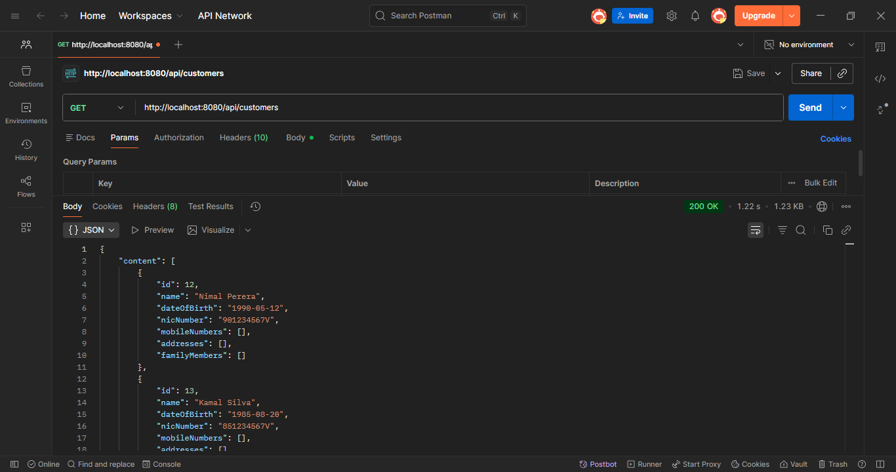
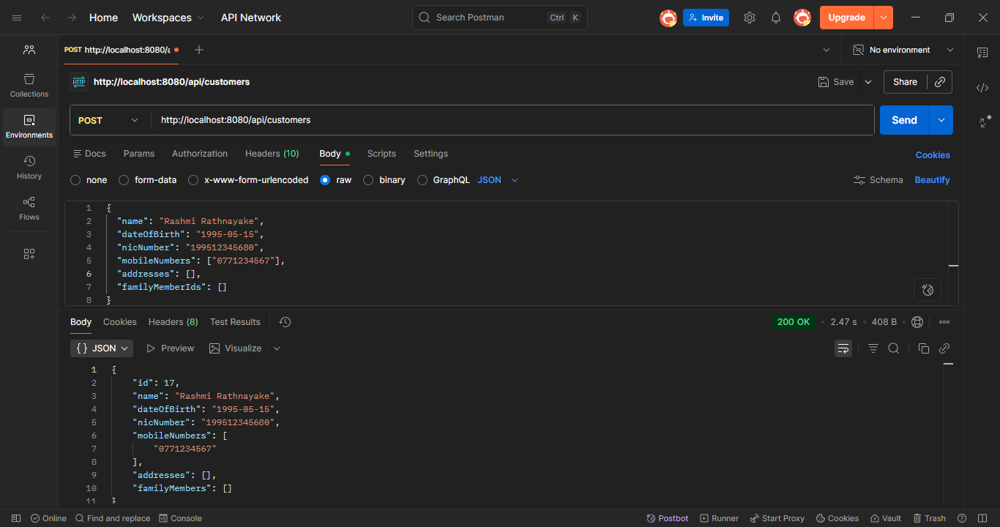
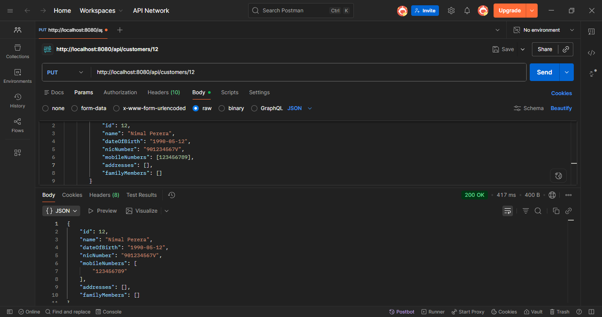
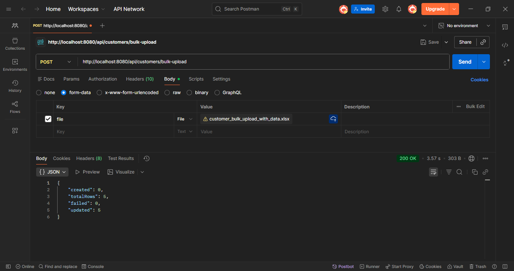

# rashmi-cms-services

Spring Boot backend for the Customer Management System.

## Tech Stack
- Java 17 (Spring Boot 3.x requires minimum Java 17)
- Spring Boot 3.5.x
- MariaDB
- Spring Data JPA / Hibernate
- Apache POI (Excel processing)
- JUnit 5
- Maven
- Lombok

> **Note:** The assignment specifies Java 8. However, Spring Boot 3.x
> requires Java 17 as minimum. All functional requirements are fully implemented.

## API Endpoints

### Get All Customers
`GET /api/customers`


### Create Customer
`POST /api/customers`


### Update Customer
`PUT /api/customers/{id}`


### Bulk Upload
`POST /api/customers/bulk-upload`


## Prerequisites
- Java 17+
- Maven 3.6+
- MariaDB 10.6+

## Database Setup
1. Open HeidiSQL or DBeaver
2. Create database:
```sql
CREATE DATABASE cms_db CHARACTER SET utf8mb4;
```
3. Create user:
```sql
CREATE USER 'cms_user'@'localhost' IDENTIFIED BY 'cms_pass';
GRANT ALL PRIVILEGES ON cms_db.* TO 'cms_user'@'localhost';
FLUSH PRIVILEGES;
```
4. Run `db/schema.sql` to create tables
5. Run `db/data.sql` to load master data (cities, countries)

## How to Run
```bash
cd cms-services
mvn spring-boot:run
```
Server starts at: `http://localhost:8080`

## How to Run Tests
```bash
mvn test
```

## API Endpoints

### Customers
| Method | URL | Description |
|--------|-----|-------------|
| GET | /api/customers | Get all customers (paged) |
| GET | /api/customers/{id} | Get customer by ID |
| POST | /api/customers | Create customer |
| PUT | /api/customers/{id} | Update customer |
| DELETE | /api/customers/{id} | Delete customer |
| POST | /api/customers/bulk-upload | Bulk upload via Excel |

### Master Data
| Method | URL | Description |
|--------|-----|-------------|
| GET | /api/cities | Get all cities |
| GET | /api/countries | Get all countries |

## Bulk Upload Excel Format
| Column A | Column B | Column C |
|----------|----------|----------|
| Name | Date of Birth (YYYY-MM-DD) | NIC Number |

- Supports up to 1,000,000 records
- Processed in batches of 500 to manage memory
- Existing NICs are updated, new NICs are created

## Project Structure
```
src/
├── controller/    # REST controllers
├── service/       # Business logic
├── entity/        # JPA entities
├── repository/    # Spring Data repositories
├── dto/           # Data transfer objects
db/
├── schema.sql     # DDL - table definitions
├── data.sql       # DML - master data
```